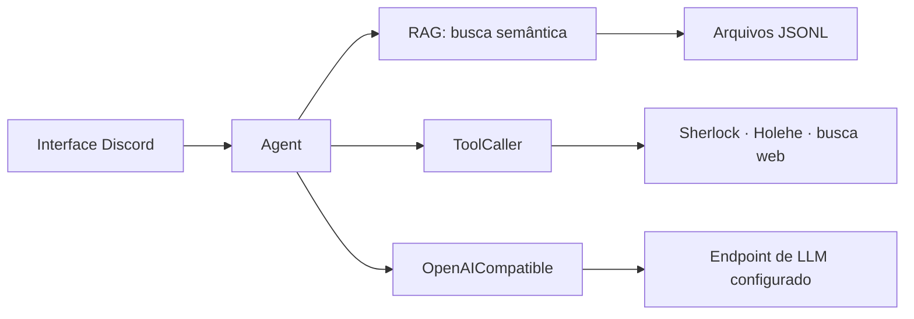

# DataCenter AI

Agente experimental para Discord que combina recuperação de contexto local, chamadas de ferramentas e um provider compatível com a API OpenAI.

## Arquitetura



O `Agent` coordena a consulta: recupera até 15 documentos via `RAG`, monta as mensagens, envia-as ao provider e despacha a primeira chamada de ferramenta retornada, se houver. O RAG fornece contexto adicional; as instruções em `bot/rules.txt` também permitem respostas sem contexto recuperado e o uso de ferramentas.

`BaseProvider`, `ProviderResponse` e `ToolCall` definem a interface comum. A única implementação presente é `OpenAICompatible`, baseada na SDK `openai` e no formato Chat Completions com tools. Ela pode apontar para endpoints que implementem esse protocolo. Isso descreve compatibilidade técnica, não integrações específicas testadas. Não há implementações dedicadas para OpenAI, OpenRouter, Gemini ou Anthropic.

## Funcionalidades atuais

- Comando `.transcend <pergunta>` pela interface Discord.
- Busca semântica em JSONL com `all-MiniLM-L6-v2` e FAISS; o índice é construído em memória na inicialização.
- Tool calling para `sherlock`, `holehe` e `search` (busca web via `googlesearch-python`).
- Respostas divididas em mensagens de até 2.000 caracteres.
- Logging configurado em `utils/logging.py` e roteiro de avaliação manual em `evals/`.

O despacho de tools procura dinamicamente em `Tools` o método cujo nome corresponde à função registrada. O agente executa apenas a primeira tool call recebida e retorna seu resultado diretamente; não envia o resultado de volta ao modelo para uma rodada de interpretação adicional. Sherlock e Holehe dependem dos executáveis correspondentes no `PATH`. A busca web depende de acesso ao serviço consultado. Falhas nas tools não têm tratamento uniforme: algumas são impressas e podem retornar `None`, enquanto erros na busca web podem propagar.

## RAG e dados

O RAG percorre `data/**/*.jsonl`; cada linha não vazia deve ser um objeto JSON. Linhas `metadata` são ignoradas. Outros registros são formatados como anúncios de troca ou dados de itens, convertidos em embeddings e adicionados ao índice FAISS. Anúncios indicam o que foi listado, não confirmam transações concluídas.

Os dados locais não são distribuídos pelo repositório: `data/` é ignorada pelo Git. Coloque os arquivos JSONL necessários nessa pasta antes de iniciar a aplicação. Sem documentos válidos, a importação do módulo RAG falha. Tanto a leitura de dados quanto `bot/rules.txt` usam caminhos relativos à pasta de execução.

## Configuração

`config.py` lê as seguintes variáveis do `.env`:

| Variável | Uso atual |
| --- | --- |
| `LLM_INTEGRATION_TOKEN` | Token passado ao cliente Discord |
| `LLM_API_KEY` | Chave enviada ao endpoint do provider |
| `LLM_BASE_URL` | URL base usada por `OpenAICompatible` |
| `LLM_MODEL` | Modelo enviado ao endpoint |
| `LLM_PROVIDER` | Lida pela configuração, mas ainda não usada para selecionar provider |

Exemplo de `.env` para a configuração atual:

```dotenv
LLM_INTEGRATION_TOKEN=seu_token
LLM_API_KEY=sua_chave
LLM_BASE_URL=https://api.groq.com/openai/v1
LLM_MODEL=openai/gpt-oss-120b
LLM_PROVIDER=openaicompatible
```

O exemplo acima usa Groq como endpoint; `OpenAICompatible` não está acoplado exclusivamente a esse serviço. Configure URL, chave e identificador do modelo de acordo com o endpoint escolhido.

O arquivo `.env.example` contém esses nomes como modelo. Copie-o para `.env` e substitua os valores de exemplo pelas suas credenciais e configurações locais. `LLM_PROVIDER` é lida pelo `config.py`, mas ainda não controla a seleção do provider.

## Instalação e execução

Requer Python 3.11 ou superior, dependências de `requirements.txt` e arquivos de dados em `data/`.

```bash
python -m venv .venv
```

Ative o ambiente virtual e instale as dependências:

```bash
pip install -r requirements.txt
```

Copie `.env.example` para `.env`, preencha as configurações, adicione os JSONL e execute a partir da raiz do repositório:

```bash
python main.py
```

No Discord, use:

```text
.transcend Analise os anúncios disponíveis sobre Kitsune.
```

O cliente está configurado com `discord.py-self` e `self_bot=True`, ou seja, automatiza uma conta de usuário. Verifique os termos da plataforma antes de usar.

## Estrutura

```text
.
├── bot/
│   ├── discord.py          # Interface Discord
│   └── rules.txt           # Instruções do agente
├── core/
│   ├── agent.py            # Orquestra RAG, tools e provider
│   └── rag.py              # Indexação e recuperação semântica
├── data/                   # Dados JSONL locais, ignorados pelo Git
├── evals/
│   └── manual_eval.py      # Prompts e avaliação exploratória
├── providers/
│   ├── base.py             # Tipos e interface abstrata
│   └── openaicompatible.py # Provider via SDK OpenAI-compatible
├── tools/
│   ├── ToolCaller.py       # Registro e despacho de tools
│   └── tools.py            # Sherlock, Holehe e busca web
├── utils/
│   └── logging.py          # Configuração de logging
├── config.py
├── main.py
└── requirements.txt
```

## Limitações conhecidas

- A seleção de provider não é configurável: `main.py` instancia diretamente `OpenAICompatible`.
- `evals/manual_eval.py` faz chamadas reais ao endpoint configurado e requer credenciais válidas e dados JSONL locais.
- O índice FAISS é reconstruído em memória a cada inicialização; não há persistência do índice.
- O fluxo de tools não faz uma segunda chamada ao modelo para interpretar os resultados.

## Licença

Distribuído sob a licença [MIT](LICENSE).

---

Projeto experimental em desenvolvimento. A arquitetura e as integrações podem mudar.
