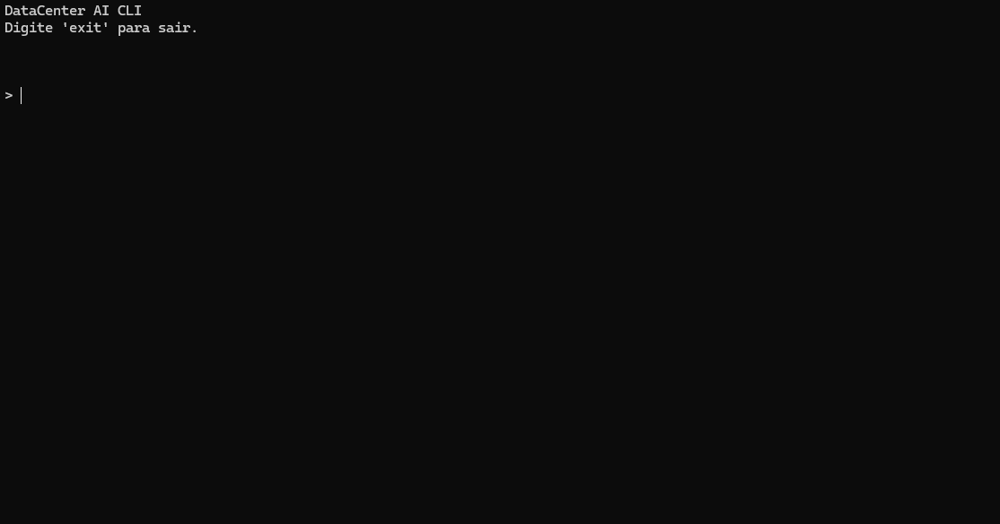
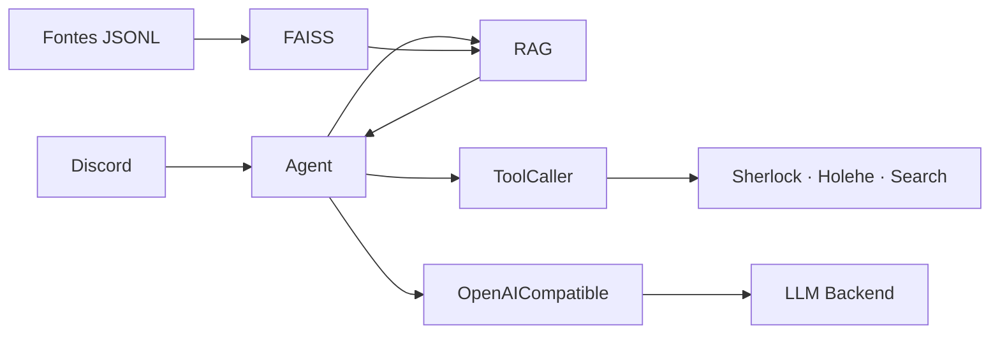

<div align="center">

# 🧠 DataCenter AI

### Context-aware Discord agent with RAG, tools, and configurable providers

**RAG · Semantic Search · Tool Calling · Extensible Providers**

<p>
  
  
  
  
</p>

Agente experimental que combina contexto local, ferramentas externas e um backend de LLM compatível com a API OpenAI. O conjunto de dados atual se concentra em anúncios de trading de Blox Fruits.

</div>

---

## Demonstração

<div align="center">



<sub>Consulta executada pelo agente utilizando RAG, recuperação semântica de contexto e geração via LLM.</sub>

</div>


## Funcionalidades

- **RAG** — recupera contexto relevante de arquivos JSONL locais.
- **FAISS** — busca vetorial em índice construído na inicialização.
- **Tool Calling** — permite ao modelo solicitar ferramentas externas.
- **Providers** — separa o agente da integração com o backend de LLM.
- **Discord** — interface atual via comando `.transcend`.
- **Async** — chamadas ao modelo e ferramentas usam operações assíncronas.

## Arquitetura



O `Agent` coordena o contexto recuperado, as chamadas de ferramentas e a geração da resposta. RAG adiciona contexto à solicitação; as instruções em [`bot/rules.txt`](bot/rules.txt) também permitem responder com ferramentas ou conhecimento geral quando apropriado.

## Providers

| Componente | Papel |
| --- | --- |
| `BaseProvider` | Contrato assíncrono comum para geração de respostas. |
| `OpenAICompatible` | Implementação atual, usando a SDK `openai` e Chat Completions com tool calling. |
| LLM backend | Endpoint, chave e modelo configurados por variáveis de ambiente. |

O provider atual trabalha com endpoints que implementem o protocolo compatível utilizado pela SDK. A aplicação instancia `OpenAICompatible` diretamente; não há seleção automática de provider nem implementações específicas para outros protocolos.

## RAG e fontes de contexto

O sistema lê arquivos em `data/**/*.jsonl`, gera embeddings com Sentence Transformers (`all-MiniLM-L6-v2`) e indexa os vetores em FAISS na memória. Para cada consulta, o agente recupera até 15 documentos relevantes.

A pasta `data/` é ignorada pelo Git e os dados não acompanham o repositório. Adicione seus arquivos JSONL antes de iniciar o agente. Sem documentos válidos, a inicialização do RAG falha. Os anúncios descrevem ofertas publicadas; não comprovam que uma troca foi concluída.

## Tools

As funções registradas e implementadas atualmente são:

| Tool | Descrição |
| --- | --- |
| `sherlock` | Pesquisa um username em serviços públicos; requer o executável Sherlock no `PATH`. |
| `holehe` | Consulta serviços associados a um e-mail; requer o executável Holehe no `PATH`. |
| `search` | Busca na web usando `googlesearch-python`. |

## Tech Stack

<div align="center">


<br><br>


</div>

## Configuração

`config.py` carrega estas variáveis do arquivo `.env`:

| Variável | Uso |
| --- | --- |
| `LLM_INTEGRATION_TOKEN` | Token usado pela interface Discord. |
| `LLM_API_KEY` | Chave de acesso ao endpoint de LLM. |
| `LLM_BASE_URL` | URL base do endpoint usado por `OpenAICompatible`. |
| `LLM_MODEL` | Identificador de modelo enviado ao endpoint. |
| `LLM_PROVIDER` | Lida pela configuração, mas ainda não seleciona a implementação. |

O [`.env.example`](.env.example) contém valores de exemplo. Substitua-os no seu `.env`:

```dotenv
LLM_INTEGRATION_TOKEN=seu_token_do_discord
LLM_API_KEY=sua_chave_do_endpoint
LLM_BASE_URL=https://api.groq.com/openai/v1
LLM_MODEL=openai/gpt-oss-120b
LLM_PROVIDER=openaicompatible
```

O exemplo aponta para Groq; o provider não está preso a esse endpoint, desde que outro backend implemente o protocolo compatível esperado.

## Instalação e execução

1. Clone o repositório:

   ```bash
   git clone https://github.com/quixaba-dev/DataBot.git
   cd DataBot
   ```

2. Crie e ative um ambiente virtual:

   ```bash
   python -m venv .venv
   source .venv/bin/activate
   ```

   No Windows PowerShell, ative com `.\.venv\Scripts\Activate.ps1`.

3. Instale as dependências:

   ```bash
   pip install -r requirements.txt
   ```

4. Copie `.env.example` para `.env` (`cp .env.example .env`) e preencha as credenciais e configurações.
5. Adicione os arquivos JSONL à pasta `data/`.
6. Inicie a partir da raiz do projeto:

   ```bash
   python main.py
   ```

No Discord, use `.transcend <pergunta>`. O agente envia as respostas em partes de até 2.000 caracteres.

> A interface usa `discord.py-self` com `self_bot=True`, que automatiza uma conta de usuário. Confira os termos aplicáveis da plataforma antes de usar.

## Estrutura

```text
.
├── bot/
│   ├── discord.py          # Interface Discord
│   └── rules.txt           # Instruções do agente
├── core/
│   ├── agent.py            # Orquestra RAG, tools e provider
│   └── rag.py              # Embeddings, FAISS e recuperação
├── data/                   # Fontes JSONL locais (ignoradas pelo Git)
├── evals/
│   └── manual_eval.py      # Avaliação exploratória
├── providers/
│   ├── base.py             # Interface e tipos comuns
│   └── openaicompatible.py # Provider atual
├── tools/
│   ├── ToolCaller.py       # Registro e dispatch
│   └── tools.py            # Implementações das ferramentas
├── utils/
│   └── logging.py          # Configuração de logs
├── config.py
├── main.py
└── requirements.txt
```

## Limitações conhecidas

- `main.py` instancia `OpenAICompatible` diretamente; `LLM_PROVIDER` ainda não troca o backend.
- O índice FAISS é reconstruído em memória a cada inicialização.
- O agente executa uma tool call por resposta do modelo e não faz outra rodada de LLM para interpretar o resultado.
- A avaliação em `evals/manual_eval.py` faz chamadas reais ao endpoint e requer credenciais e dados locais.
- O cliente Discord está configurado em modo self-bot.

## License

Distributed under the MIT License. See [`LICENSE`](LICENSE) for details.

---

<div align="center">

### DataCenter AI

`LLM` • `RAG` • `Semantic Search` • `Tool Calling`

Built with Python 🐍

</div>
